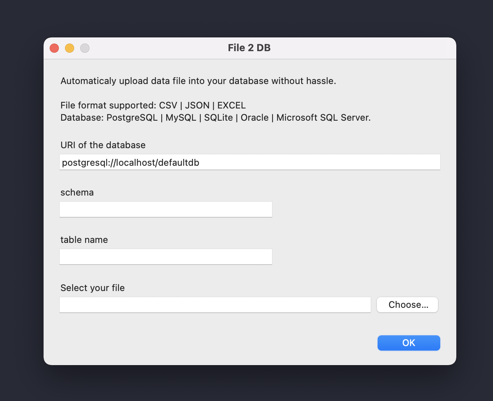

# File2DB

A mini OS X app to simply upload a CSV/JSON/EXCEL file to a database (PostgreSQL | MySQL | SQLite | Oracle | Microsoft SQL Server).
You don't need to create the table structure, the application extract it from analysing the content of the file.

### Download
Go to [Release](https://github.com/BenderV/file2db/releases) to download the app.

### How
Behind the scene, it's simply a wrapper on the awesome [Pandas.to_sql](https://pandas.pydata.org/pandas-docs/stable/reference/api/pandas.DataFrame.to_sql.html) function.

To make it an app, we use Pashua & Platypus.

### Build it

1. Download Pashua: `curl https://www.bluem.net/files/Pashua.dmg`
2. Create a python virtual environment: `virtualenv -p $(which python) venv`
3. Activate the environment: `source venv/bin/activate`
4. Install dependancies: `pip install -r requirements.txt`
5. Download [Platypus](https://sveinbjorn.org/platypus) and install it.
6. Start platypus and create the app. See [the configuration example](assets/platypus.png)
